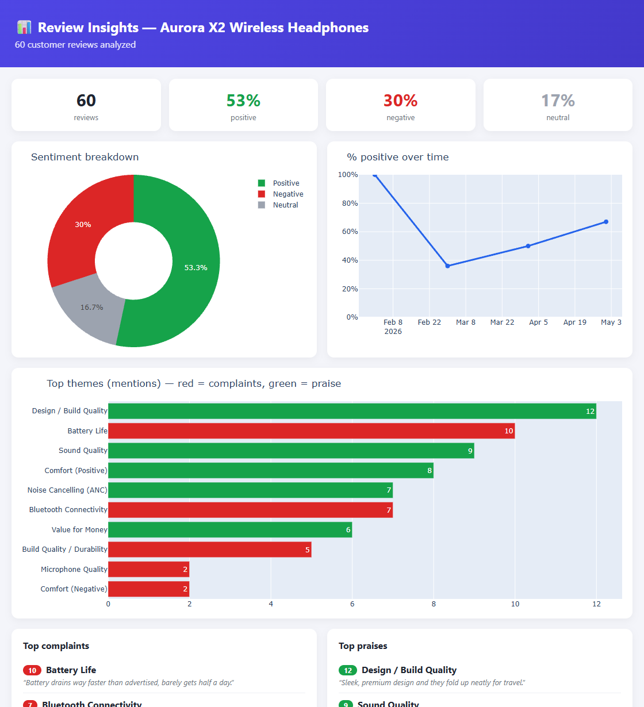

# review insights dashboard

feed it a csv of product reviews and it builds one self-contained html dashboard - the overall sentiment split, the recurring complaint and praise themes (with real example quotes and counts), and how sentiment moved over time - so a seller can see what customers actually think without reading hundreds of reviews

## the problem

a product with a few hundred marketplace reviews is impossible to keep up with by hand, the star ratings don't tell you *why* people are unhappy, and a systemic issue (a bad battery, a flaky bluetooth connection) hides in the noise until it's a wave of refunds

## what it does

- sentiment in batches, every review is classified positive / negative / neutral by gemini but batched (~20 per request) so a few hundred reviews cost a handful of api calls instead of one each
- theme clustering, one pass groups the reviews into recurring complaint and praise themes, merging synonyms ("battery dies fast" + "poor battery life" become one), each with a count and a verbatim example
- trend over time, reviews get bucketed by month to chart the percent positive, so you see *when* something went wrong not just that it did
- one plotly html file (sentiment donut, themes bar, trend line, top-5 lists) that opens in any browser, no server

## result

ran live on 60 synthetic reviews for a pair of wireless headphones, seeded with a story - happy early, a cluster of battery/bluetooth complaints in late march, then a recovery



the trend line is flat all through the baseline then drops to ~36% positive on the complaint days, and clustering pulled battery and bluetooth as the top pain points, design and sound as the strengths, the whole run took about four gemini calls

## run it

```
pip install -r requirements.txt
cp .env.example .env          # add your GEMINI_API_KEY, free from https://ai.google.dev
python generate_demo_reviews.py
python main.py --input demo_reviews.csv --output review_dashboard.html
```

open `review_dashboard.html`, point `--input` at your own csv (review_text, rating, date) for real reviews

## files

```
main.py                    cli, read csv -> sentiment -> clustering -> dashboard
sentiment.py               batched positive/negative/neutral classification
clustering.py              recurring complaint/praise themes + example quotes
dashboard.py               self-contained plotly html
generate_demo_reviews.py   synthetic demo dataset with a built-in trend
```
